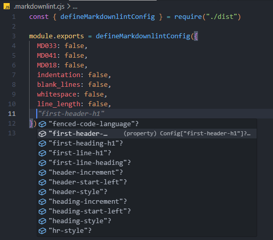
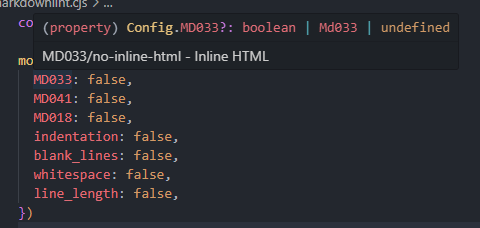

# markdownlint-define-config

[](https://www.npmjs.com/package/@lehoczky/markdownlint-define-config)

Provide a `defineMarkdownlintConfig()` function for [markdownlint](https://github.com/DavidAnson/markdownlint) configuration files. Inspired by vite's [defineConfig](https://vitejs.dev/config/#config-intellisense) and [eslint-define-config](https://github.com/Shinigami92/eslint-define-config).

With `defineMarkdownlintConfig()` you can have type checking, documentation, deprecation warnings, and autocompletion support directly in your `.markdownlint.js` file:





## 💿 Installation

```sh
# add markdownlint-cli2 and markdownlint-define-config to project’s dev dependencies
npm add --save-dev markdownlint-cli2 @lehoczky/markdownlint-define-config
# or
yarn add --dev markdownlint-cli2 @lehoczky/markdownlint-define-config
# or
pnpm add --save-dev markdownlint-cli2 @lehoczky/markdownlint-define-config
```

## 💻 Usage

In your `.markdownlint.js`:

<!-- prettier-ignore-start -->

```js
// @ts-check
const { defineMarkdownlintConfig } = require("@lehoczky/markdownlint-define-config")

module.exports = defineMarkdownlintConfig({
  // rules...
})
```

<!-- prettier-ignore-end -->
